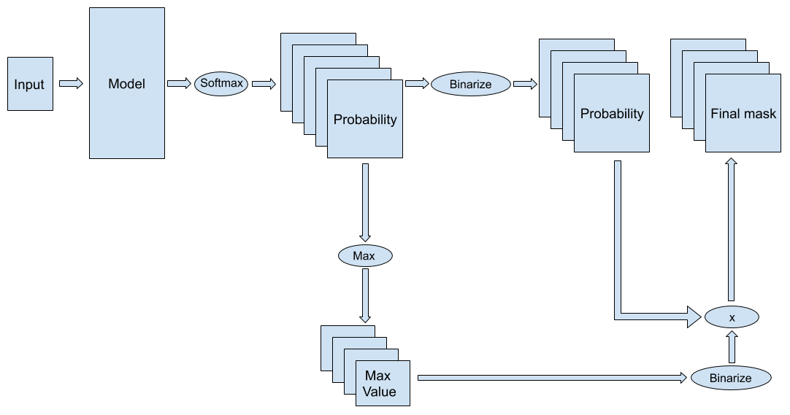

# Severstal-Steel-Defect-Detection-Kaggle (108th place solutions)

Code for Kaggle competition kaggle.com/c/severstal-steel-defect-detection

## Score

Chosen submission:

| Public LB | Private LB |
| --- | --- |
| 0.91175   | 0.90075    |

Best submission (__51th place__):

| Public LB | Private LB |
| --- | --- |
| 0.91089   | 0.90290    |

## Summary
- __Basic Model__:​ Unet

- __Encoder__:​ efficientnet-b3, efficientnet-b4, se-resnext50

- __Loss__:​ Focal Loss

- __Optimizer__:​ Adam, init lr = 0.0005

- __Learning Rate Scheduler__:​ ReduceLROnPlateau (factor=0.5, patience=3,cooldown=3, min_lr=1e-8)

- __Image Size__:​ 256x800 for training, 256x1600 for inference

- __Image Augmentation__: horizontal flip, vertical flip, blur

- __Sampler__: Weighted Sampler

- __Ensemble Model__: simply average 5 model output probability to achieve the final mask probability without TTA
  1. Unet + efficientnet-b4, training with heavy image augmentation
  2. Unet + efficientnet-b4 + SCSE layer
  3. Unet + efficientnet-b4 + Mish layer
  4. Unet + efficientnet-b3
  5. Unet + se-resnext50

__Threshold__
Label Thresholds: 0.7, 0.7, 0.6, 0.6
Pixel Thresholds: 0.4, 0.4, 0.4, 0.4

## Model Pipeline

You can check this [Link](https://www.kaggle.com/c/severstal-steel-defect-detection/discussion/111457#latest-654845) for more detail and code, thank to HengCherKeng!
